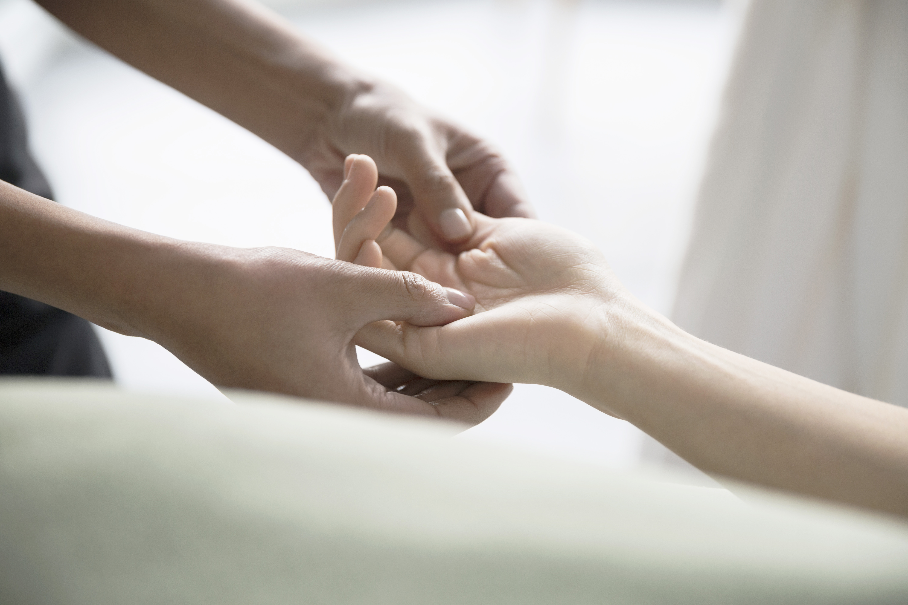
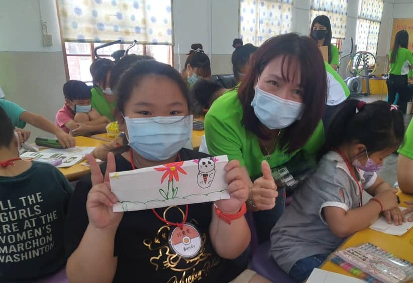
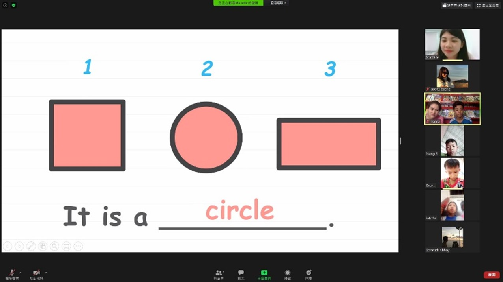
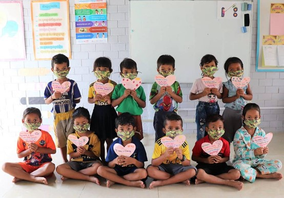

# USR EXPO (English)

## Summary

Lockdown by Threats, Link Up in Love: Wenzao Healthcare Communication-USR

In 2020, due to the lockdown for COVID-19 prevention, social distancing is required among people, widening the gap of fears for infection. However, Wenzao WHC-USR team has built a bridge with love from the children of Cishan Elementary School and students of Wenzao University to be extended to children in Cambodia. The fervent support from Kaohsiung have been delivered to Cambodia, melting the cold barriers of fears and warming up the Cambodian young souls.

Located located in the rural area of Kaohsiung, Cishan Elementary School was a perfect choice to pass down the concepts of pandemic prevention and environmental protection to children at a young age. In May, seven teachers from Wenzao USR team arrived with 27 students enrolling in Professional Service Learning and Leadership to conduct a camp after a series of work as analysis of the needs, English lesson and teaching materials design, teaching demos and review, all in the hope of making hygiene education closely connected to children's daily life. The Topics included Dengue Fever and recycling, and activities such as making simple facial masks and packaging mask covers with English instructions were organized. In these activities, students from Cishan also wrote encouraging words on the greeting cards for COVID-19 prevention to the children in Cambodia (as shown in Picture 1).

Due to COVID-19, almost all the English classes in the Green Umbrella system, including KKS, i.e. the WHC-USR partnering school in Cambodia, were suspended. Local children could only stay at home without any opportunities for learning. Wenzao international volunteers boldly pursued the mission of online teaching as leading figures, overcome such technical problems as tailoring appropriate English materials, applying suitable web-conferencing facilities and designing lively synchronous lessons and interactive tasks,  and finally managed to run the once-per-week online English course with those Cambodian children who were able to use mobile phones for learning. 12 students from the partnering KKS, aged from 9 to 11, participated in the online course; it was the first time for these students with only basic knowledge of the alphabet to learn English from home on the 25-dollar-worth cell phones provided by GU.  Four Wenzao international volunteers interacted with the children through gestures, voice, facial expressions, or even in simple games. Starting from nearly zero competence, these Cambodian children got rid of their shyness with encouragement and assistance from the volunteers, and finally ended up expressing clearly in complete sentences and in confidence. Despite being physically far from the students, volunteers truly felt from the smiles on the children's faces that the distance was shortened and one step was made closer in their relationship.  Certainly, it was impossible for children to master a language in a few hours as the goal targeted mainly on motivation for learning English. Volunteers deeply believe that education is a journey where one life inspires another through love. Be it the children who were taught or those who taught, the zeal for life was mutually ignited in their

souls by the ardours they shared, a heating touch of education.

The reusable facial mask covers and the greeting cards made in May by Taiwanese volunteers and children were safely delivered to Cambodia after a long winding trip. The Cambodian faculty and students happily received not only new materials for pandemic prevention but also ample love from Taiwan, which would prevail incessantly in other parts of Cambodia, stated Master Sokrath, the venerable founder of KKS.

In addition to care for the wellbeing of children in rural Taiwan and Cambodia, WHC-USR offered pandemic news updates in five languages on LINE app and IG, featuring pandemic prevention and hygiene education for migrant workers and new immigrants. The Wenzao faculty proficient in English, Vienamese, Indonesian, and Thai worked apace on pandemic news translation through a collaboration project with Kaohsiung Municipal Siaogang Hospital. Greatly assisted by the joint efforts of medical specialists, WHC-USR rendered professional language services to contribute to Taiwan's pandemic prevention, especially through the hygiene programs and easily accessible news network for migrant workers in the industrial zones (as in pictures 4 & 5).

WHC-USR has already proceeded into its third year of services. In the previous two years, students were trained to work as volunteers at three hospitals in Kaohsiung to assist new immigrants and migrant workers in reducing language and cultural barriers in patient-medical personnel communication (as in Picture 6). Also the team traveled to Cambodia with partners from KVGH to help with hygiene and environmental protection education (as in Picture 7). As international volunteering remained idle due to the global lockdown, WHCl-USR soon readjusted for new challenges by switching to service for new residents and migrant workers in Taiwan, hygiene education for rural schools, online English courses for Cambodian children. Now that the pandemic has been closely monitored in Taiwan, our volunteers will resume work at KVGH, E-da Hospital and KMSH starting in October. WHC-USC employs its vantage points in language and internationalization to initiate care for the less privileged in language communication. By mobilizing resources within the university and collaborating with three neighboring hospitals, our project adhere to international volunteering professional services with  "accessibility of medical healthcare" and "learning without borders" in our vision.

## Photos

### Image Descriptions

- **Picture 1**: With the help of Wenzao faculty and students, Cishan Elementary School students painted on mask covers and greeting cards.
- **Picture 2, 3**: Cross-boundary collaboration for the online English course by faculty and students
- **Picture 4**: Wearing mask covers from Taiwan, Cambodian children showed their big thank-you card.
