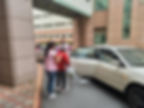
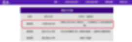
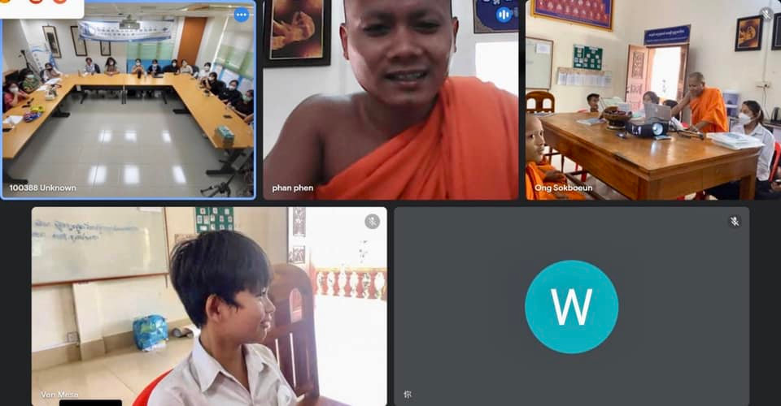
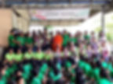
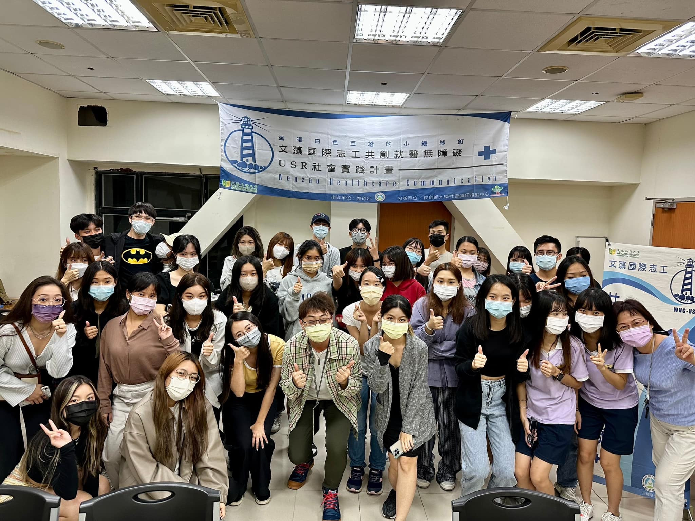
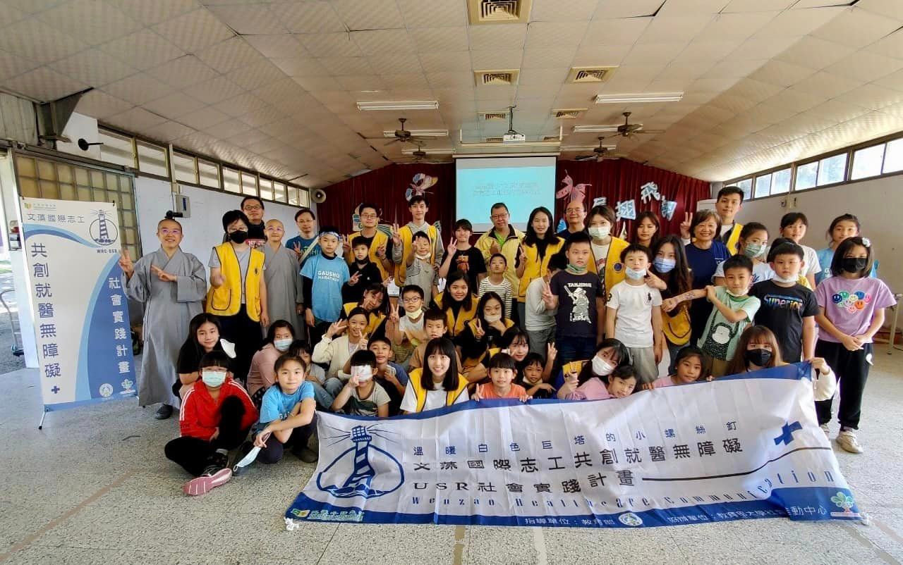
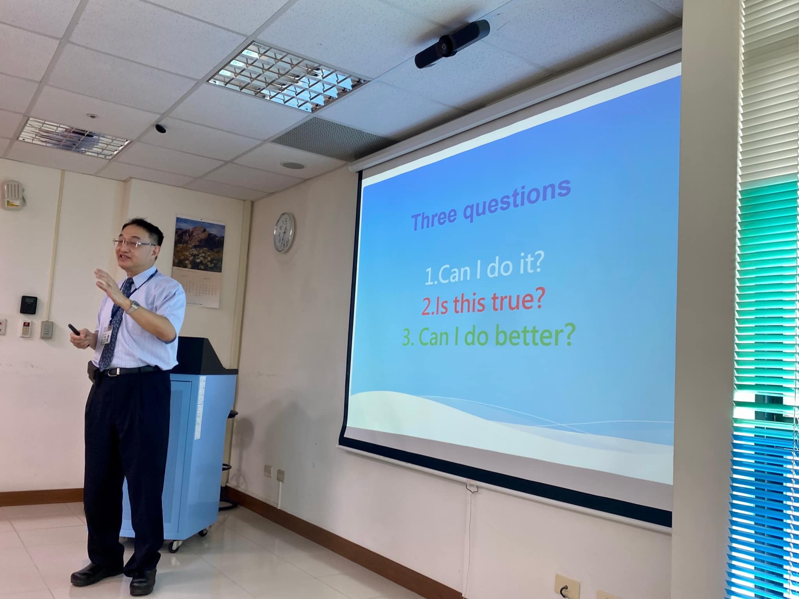
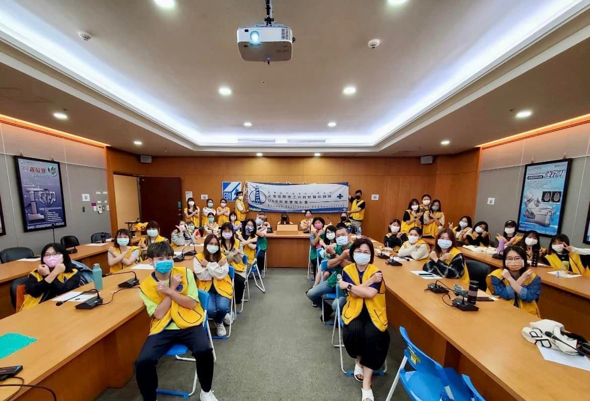

# 實踐場域 Practice Fields

文藻 USR 計畫在多個場域實踐大學社會責任，結合外語專業提供志工服務。

---

## 醫療場域

| 場域 | 合作起始 | 服務內容 |
|------|---------|---------|
| 義大醫院 | 2019/09 | 外籍就醫口譯、多語衛教 |
| 高雄榮民總醫院 | 2016/10 | 外籍就醫口譯、行政支援 |
| 高雄市立小港醫院 | 2019/03 | 外籍就醫口譯、衛教繪本 |

---

## 教育場域

---

## 國際場域

---

## 產業場域

---

## 加入服務

想參與志工服務？歡迎加入小螺絲釘團隊！

[:material-arrow-right: 查看招生資訊](join.md){ .md-button .md-button--primary }
