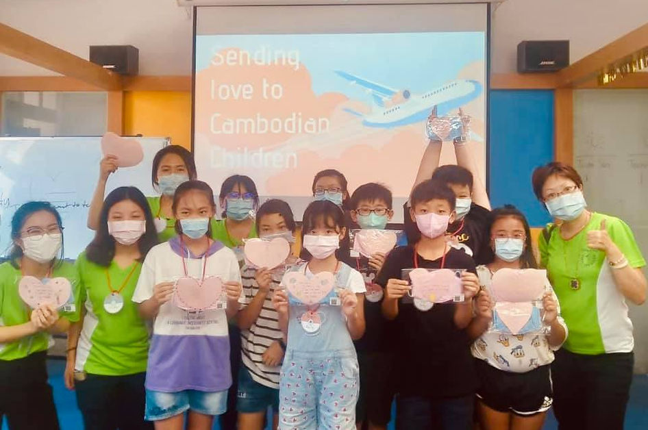
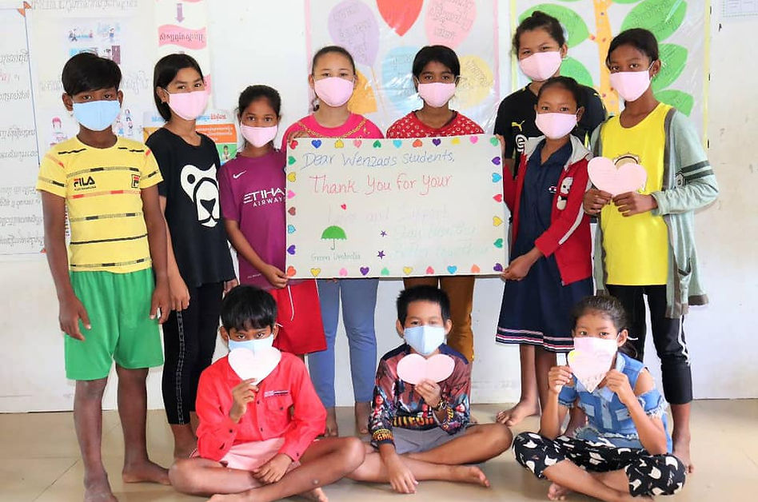

# 媒體報導 News Report

## 計畫獲獎與媒體報導

文藻 USR 計畫多次獲得全國性獎項肯定，並受到各大媒體關注報導。

---

## 重要獲獎

### 2021 USR EXPO 最佳亮點故事獎
從 204 件參賽計畫故事中脫穎而出，最終進入 36 件亮點故事，榮獲「社會關懷」組亮點故事獎。

[:octicons-link-external-16: 詳細資料](https://tinyurl.com/yb6wj3c3){ .md-button }

---

### 2021 遠見雜誌 USR 楷模獎
《遠見》高標評鑑 USR 142 件參賽方案，獲獎率僅 11.2%。文藻大學以學校的外語優勢，鎖定地區新住民和移工就醫時語言溝通問題為主題，榮獲福祉共生組「楷模獎」。

[:octicons-link-external-16: 詳細資料](https://csr.gvm.com.tw/2021/winner.html){ .md-button }

---

### 2020 台灣企業永續獎 大學 USR 銀獎
榮獲第 13 屆台灣企業永續獎大學 USR 永續方案獎銀獎。

[:octicons-link-external-16: 詳細資料](https://tcsaward.org.tw/tw/news/index/231){ .md-button }

---

### 2020 USR EXPO 微電影入圍
全國 217 個計畫中入圍微電影競賽。

---

## 媒體報導精選

| 日期 | 媒體 | 標題 |
|------|------|------|
| 2025 | Facebook | [2025 蚵寮 AI 永續探索營](https://www.facebook.com/share/1M2CD1uPvh/) |
| 2025 | YouTube | [蚵寮營隊開幕影片](https://youtu.be/E_JgudXUH0k) |
| 2025 | YouTube | [蚵寮營隊閉幕影片](https://youtu.be/Yb3AbLhPZ3E) |

---

## 年度媒體報導

### 113 年

| 日期 | 媒體 | 標題 |
| --- | --- | --- |
| 113/07/01 | 1111人力銀行 | 產經新聞網。 文藻USR團隊挺進蚵仔寮 用AI助學童說故鄉事 |
| 113/06/30 | 經濟日報 | 文藻USR團隊挺進蚵仔寮 用AI助學童說故鄉事 |
| 113/06/30 | 台灣好報 | 文藻USR團隊挺進蚵仔寮用AI助學童說故鄉事 |
| 113/06/30 | 台灣新生報 | 文藻外大USR團隊挺進蚵仔寮 用AI助學童說故鄉事 。 |
| 113/06/30 | 文藻首頁 | 文藻USR團隊挺進蚵仔寮 用AI助學童說故鄉事 |

### 111 年

| 日期 | 媒體 | 標題 |
| --- | --- | --- |
| 111/02/15 | 文藻校網 | 落實大學社會責任 文藻外大獲教育部最佳亮點故事獎。 |
| 111/02/15 | 今周刊-FB​ | 參加國際志工為大學生帶來什麼? |
| 111/03/19 | 幸福廣播電台 | 【0319 #幸福任意門】S8國際醫療與外交-文藻國際醫療志工的溫暖計畫 。 |
| 111/03/22 | 幸福廣播電台 | 幸福任意門-幸福廣播電台 。 |
| 111/05/16 | 教育部USR推動中心FB | 繪本APP來囉~ |
| 111/05/24 | 教育部USR推動中心FB | Inter-NET UTD 國際線上全英網路研討會(Webinar)活動 |
| 111/05/26 | 教育部USR推動中心FB | 文藻x旗山-疫旗去探險雙語營 |
| 111/06/09 | 漾新聞 | 義大醫院攜手文藻WHC-USR團隊製作越南唇顎裂照護系列影片 國際志工成功扮演小螺絲釘角色 |
| 111/06/21 | 滔新聞 | 文藻落實大學社會責任 推動遠距英語營及新住民增能陪伴 |
| 111/06/21 | 文藻USR辦公室網頁 | 文藻落實大學社會責任 推動遠距英語營及新住民增能陪伴 |

### 110 年

| 日期 | 媒體 | 標題 |
| --- | --- | --- |
| 110/01/19 | 鮮週報 | 小港醫院攜手文藻外大 開發地點實景指引系統進駐一樓大廳啟用 。 |
| 110/01/19 | 聯合新聞網 | 小港醫院啟用「實景指引系統」與「LINE@官方帳號」 |
| 110/01/19 | 波新聞 | 就醫方便再升級 小港醫院推LINE官方帳號服務／波新聞 |
| 110/01/19 | 自由時報 | 開發院內實景指引 小港醫院推LINE就醫服務再升級 |
| 110/01/19 | 經濟日報 | 就醫方便再升級 小港醫院推LINE官方帳號服務 |
| 110/01/19 | 台銘新聞網 | 就醫方便再升級 小港醫院推LINE官方帳號服務 |
| 110/01/19 | 高雄都會台慶聯港都 | 醫療服務|就醫服務升級 設置院內實景指引系統 |
| 110/01/19 | 台灣新生報 | 小港醫院推LINE官方帳號服務 。 |
| 110/01/19 | 焦點時報社 | 就醫方便再升級 小港醫院推LINE官方帳號服務 |
| 110/01/20 | 台灣新聞網 | 小港醫院推LINE官方帳號服務 就醫方便再升級 |
| 110/01/20 | 台灣數位網 | 小港醫院與文藻外大合作開發「院內地點實景指引系統」與「LINE@官方帳號」啟用 創意就醫體驗 |
| 110/03/08 | 立報傳媒 | 屏科、海大表現亮眼！2021《遠見》大學社會責任獎入圍名單公布 |
| 110/04/08 | 遠見雜誌 | 2021遠見USR得獎名單出爐！北醫、逢甲、屏科、修平高格局奪首獎 |
| 110/04/21 | 中央通訊社 | 世界不斷改變，文藻服務不變 |
| 110/04/21 | 中華日報 | 世界不斷改變，文藻服務不變 |
| 110/04/21 | LINE | TODAY。 世界不斷改變，文藻服務不變 |
| 110/04/21 | Hinet | 生活誌。 世界不斷改變，文藻服務不變 |
| 110/04/21 | Pchome新聞 | 世界不斷改變，文藻服務不變 |
| 110/04/21 | 台灣好報 | 世界不斷改變，文藻服務不變 |
| 110/04/21 | CNA訊息平台 | 世界不斷改變，文藻服務不變 |
| 110/04/21 | 經濟日報 | 第二屆遠見USR 文藻外大奪福祉共生組楷模獎 |
| 110/04/21 | 鮮週報 | 2021年第二屆遠見大學社會責任獎 文藻外大榮膺福祉共生組楷模獎 |
| 110/04/21 | 三立新聞網。U | SR入圍名單公布　角逐最終獎項！屏科、海大表現亮眼 |
| 110/04/22 | 台灣數位新聞全球網 | 文藻外大「國際志工共創就醫無障礙」USR計畫 獲遠見大學社會責任獎福祉共生組楷模獎 |
| 110/04/22 | 中華新聞雲 | 世界不斷改變，文藻服務不變 |
| 110/11/23 | 波新聞 | 關懷東南亞移工 文藻USR團隊舉辦移工攝影展 |
| 110/11/23 | 文藻外語大學校網 | 關懷東南亞移工 文藻USR團隊舉辦移工攝影展 |
| 110/11/23 | 經濟日報 | 關懷東南亞移工 文藻USR團隊舉辦移工攝影展 |
| 110/11/23 | 漾新聞 | 文藻大學辦移工攝影展 一張照片一個故事 是喜悅也可能是心酸／漾新聞Young |
| 110/11/23 | 鮮新聞 | 文藻外大USR計畫攜手台灣四十分之一移工教文協會 合辦攝影特展記錄在台移工身影 |
| 110/11/24 | 人聞財經報 | 關懷東南亞移工 文藻USR團隊舉辦「移工文化-轉機在台灣-共融友好」移工攝影特展 |
| 110/11/24 | 中央訊息平台 | 關懷東南亞移工 文藻USR團隊舉辦移工攝影展 |
| 110/11/24 | LIFE生活網 | 關懷東南亞移工 文藻USR團隊舉辦移工攝影展 |
| 110/11/24 | 國立教育廣播電臺 | 文藻外大舉辦移工攝影展 帶民眾看見台灣移工世界 |
| 110/11/24 | 教育部USR推動中心FB | 關懷東南亞移工 文藻USR團隊舉辦移工攝影展 |
| 110/11/29 | 教育部USR推動中心FB | 關懷東南亞移工 文藻USR團隊舉辦移工攝影展 。 |
| 110/12/28 | 今周刊 | 。 以愛溝通，前進柬國的英語營 。 |

### 109 年

| 日期 | 媒體 | 標題 |
| --- | --- | --- |
| 109/03/07 | 台灣時報 | 投入衛教多語翻譯服務工作 文藻USR師生搭建新住民及移工防疫橋樑 |
| 109/03/09 | 聯合新聞網 | 多國翻譯防疫衛教LINE系統 移工掌握疫情零差距 |
| 109/03/09 | 鮮週報 | 高市小港醫院攜手文藻外大開發防疫小教室APP 便利外籍人士掌握防疫資訊 |
| 109/03/09 | 波新聞 | 小港醫院與文藻結合LINE官方帳號 提供多國翻譯防疫衛教 |
| 109/03/09 | 蹦新聞 | 港醫與文藻結合LINE官方帳號，提供多國翻譯防疫衛教 |
| 109/03/09 | 高雄E報 | 小港醫院、文藻結合LINE官方帳號，提供英文、越南文、泰文、印尼文多國翻譯防疫衛教 |
| 109/03/09 | 華夏興中傳媒 | 小港醫院、文藻結合LINE官方帳號，提供英文、越南文、泰文、印尼文多國翻譯防疫衛教 |
| 109/03/09 | 全球華僑報 | 小港醫院、文藻結合LINE官方帳號，提供英文、越南文、泰文、印尼文多國翻譯防疫衛教 |
| 109/03/09 | 中華新報 | 港醫與文藻結合LINE官方帳號，提供多國翻譯防疫衛教 |
| 109/03/09 | 港都新聞 | 港醫與文藻結合LINE官方帳號，提供多國翻譯防疫衛教 |
| 109/03/09 | 台灣新生報 | 港醫、文藻結合LINE官帳 提供多國翻譯防疫衛教 |
| 109/03/09 | 民時新聞 | 小港醫院與文藻外大合作 LINE系統傳播新冠肺炎訊息、衛教給在台外籍族群 |
| 109/03/09 | 台灣導報 | 港醫與文藻結合LINE 提供多國翻譯防疫衛教 |
| 109/03/09 | 中國全球華僑總會 | 小港醫院、文藻結合LINE官方帳號，提供英文、越南文、泰文、印尼文多國翻譯防疫衛教 |
| 109/03/09 | Yahoo新聞 | 港醫、文藻結合LINE官帳 提供多國翻譯防疫衛教 |
| 109/03/09 | 新聞04 | 防疫衛教LINE系統 有4國翻譯 |
| 109/03/10 | 自由時報 | 港醫與文藻合作LINE官方帳號 提供多國翻譯防疫衛教 |
| 109/03/10 | 高雄小港醫院FB#88 | 與文藻結合LINE官方帳號，提供多國翻譯防疫衛教 |
| 109/03/10 | 新住民全球新聞網 | 防疫無隔閡 小港醫與文藻合作Line帳號提供多語衛教 |
| 109/03/10 | 中華新聞雲 | 外語防疫衛教 文藻給力 |
| 109/03/11 | 新浪新聞 | 港醫與文藻結合LINE官方帳號，提供多國翻譯防疫衛教 |
| 109/03/12 | 里報 | 港醫與文藻結合LINE官方帳號，提供多國翻譯防疫衛教 |
| 109/03/12 | 雪花報導 | 移工看不懂中文霧煞煞！小港醫院「LINE推播」4語言速掌握防疫知識 |
| 109/03/16 | 教育部大學社會責任推動中心 | FB#文藻外語大學 USR師生搭建 #台灣新住民及移工防疫橋樑，即日起 #投入衛教多語翻譯服務 |
| 109/03/17 | 文藻外語大學頭條新聞 | 03/17/2020 文藻USR師生搭建台灣新住民及移工防疫橋樑 即日起投入衛教多語翻譯服務 |
| 109/03/18 | 教育部大學社會責任推動中心 | 文藻USR師生搭建台灣新住民及移工防疫橋樑即日起投入衛教多語翻譯服務 |
| 109/05/12 | 醫事聯盟FB | 當醫學遇上外語，會擦出怎樣的火花呢？ |
| 109/05/13 | 世新大學疫情資訊快譯通 | 外籍人士不漏接 |
| 109/05/18 | 文藻外語大學頭條新聞 | 05/18/2020文藻USR團隊師生前進旗山國小，教英文學防疫從小紮根，共創雙贏 |
| 109/05/18 | 文藻FB | [文藻USR團隊師生前進旗山國小，教英文學防疫從小紮根，共創雙贏] |
| 109/05/18 | 台灣時報 | 文藻前進旗山國小 教英文學防疫pdf |
| 109/05/18 | 教育部大學社會責任推動中心 | FB#文藻師生前進旗山國小教英文學防疫 |
| 109/05/20 | 台灣導報 | 等高醫與印尼泗水交流防疫對策pdf |
| 109/05/22 | 瑞儀公司官網 | 瑞儀光電防疫跨國界 攜手文藻外大衛教創「疫」宣導關懷外籍同仁 |
| 109/05/22 | 瑞儀光電 | FB瑞儀光電防疫跨國界，攜手文藻外大衛教創「疫」宣導關懷外籍同仁❗️ |
| 109/05/25 | 文藻外語大學頭條新聞 | 05/25/2020文藻外大攜手瑞儀光電 多語防疫衛教無國界 |
| 109/05/25 | 工商時報 | 瑞儀光電攜手文藻外大衛教宣導關懷外籍同仁 |
| 109/05/26 | 教育部大學社會責任推動中心 | 文藻外大攜手瑞儀光電 多語防疫衛教無國界 |
| 109/06/01 | 台灣時報 | 文藻攜手瑞儀光電　辦移工防疫宣導 |
| 109/06/02 | 文藻USR | FB 5/30期末反思慶賀 |
| 109/06/05 | 文藻外語大學頭條新聞 | 06/05/2020文藻USR學生期末慶賀防疫專業服務學習成果，新任教育部蔡清華政次與四家醫院代表及旗山國小校長共同見證衛教防疫小螺絲釘們的成長 |
| 109/06/06 | 中華海峽傳媒 | 六分局與文藻外語大學合作 宣導防制酒駕×反毒與防疫321 Action |
| 109/06/06 | 民正新聞 | 南警六分局與文藻外語大學「溫暖白色巨塔的小螺絲釘」首度共同合作「防制酒駕、反毒與防疫321 Action」宣導 |
| 109/06/06 | 臺南市政府警察局第六分局FB | 南警六分局與文藻外語大學首度共同合作「防制酒駕、反毒與防疫321 Action」宣導！ |
| 109/06/06 | 天眼日報 | 南警六分局與文藻外語大學首度共同合作「防制酒駕、反毒與防疫321 Action」宣導！ |
| 109/06/06 | 新浪新聞 | 南警六分局與文藻外語大學合作 宣導防制酒駕×反毒與防疫321 Action |
| 109/06/06 | Line | today新聞 六分局與文藻外語大學合作 宣導防制酒駕×反毒與防疫321 Action |
| 109/06/07 | 中國新聞雲 | 防酒駕反毒 六分局攜手文藻辦移工宣導 |
| 109/06/07 | LIPUTAN | BMI.comKepolisian Tainan Propagandakan 3 Action kepada Pekerja Migran, Cegah Mabuk Saat Mengemudi, Cegah Narkoba, Cegah Pandemi |
| 109/06/07 | 特急先鋒新聞網 | 南警六分局與文藻外語大學「溫暖白色巨塔的小螺絲釘」首度共同合作「防制酒駕、反毒與防疫321 Action」宣導！ |
| 109/06/09 | USR | 推動中心FB #安平工業區 #黑橋牌公司防疫衛教宣導活動 |
| 109/07/03 | 中央廣播電台USR | - Nhóm tình nguyện viên quốc tế của Đại học Văn Tảo |
| 109/07/03 | Pchome新聞 | 愛，在柬埔寨蔓延 文藻USR國際志工線上英語教學，為柬國小學生開啟通往世界的窗 |
| 109/07/03 | 中央通訊社 | 愛，在柬埔寨蔓延 文藻USR國際志工線上英語教學，為柬國小學生開啟通往世界的窗 |
| 109/07/03 | 文藻外大FB | 愛，在柬埔寨蔓延 文藻USR國際志工線上英語教學，為柬國小學生開啟通往世界的窗 |
| 109/07/03 | 新住民全球新聞網 | 文藻線上英語教學 為柬國偏鄉學生開啟通往世界的窗 |
| 109/07/03 | 文藻校網頭條07/03/2020 | 愛，在柬埔寨蔓延文藻USR國際志工線上英語教學，為柬國小學生開啟通往世界的窗 |
| 109/07/03 | 聚財網新聞 | 文藻USR國際志工線上英語教學 傳遞愛至柬埔寨 |
| 109/07/03 | 經濟日報 | 文藻USR國際志工線上英語教學 傳遞愛至柬埔寨 |
| 109/07/03 | 鮮週報 | 文藻外大USR團隊師生攜手國際志工 線上指導柬國綠雨傘小學生學習英文 |
| 109/07/03 | USR | 推動中心FB# 愛在柬埔寨蔓延 |
| 109/07/03 | Hinet | 生活誌 愛，在柬埔寨蔓延 文藻USR國際志工線上英語教學，為柬國小學生開啟通往世界的窗 |
| 109/07/03 | 滔新聞 | 愛，在柬埔寨蔓延 文藻USR國際志工線上英語教學，為柬國小學生開啟通往世界的窗 |
| 109/07/10 | 台灣文教周報 | 文藻外大國際志工線上英語教學 協助柬埔寨孩童 |
| 109/07/12 | 天主教周報 | # 愛在柬埔寨蔓延 |
| 109/07/14 | 集來國小FB | 謝謝美麗俊芳老師的無私奉獻，拋磚引玉，造福偏鄉小朋友！ |
| 109/07/17 | USR | 推動中心FB #偏鄉傳愛去 #天熱心更熱 #文藻USR |
| 109/09/10 | 青年署我「寨」線上－ | 青年海外志工推動英語教學 (70)109/10/14 焦點時報 讓愛綿延從「心」出發 義大醫院與越南微笑行動共同探討國際合作新模式 |

## 影片作品

### 師生共同創作

- [:material-youtube: 大海裡的家 - 動態繪本](https://reurl.cc/rYd6ME)
- [:material-youtube: 寄居蟹的時尚災難 - 動畫影片](https://reurl.cc/RknyAz)
- [:material-youtube: 我們一起走過 113-2](https://reurl.cc/ax043Q)

### 營隊紀錄

- [:material-youtube: 2025 蚵寮 AI 永續探索營 - 蚵生感言](https://reurl.cc/ekv3Ax)
- [:material-youtube: 線上英文陪伴 - 蚵寮啟航收航](https://reurl.cc/Om7AoX)
- [:material-youtube: 小螺絲釘期末慶祝大會](https://reurl.cc/ax04oG)

---

## USR EXPO 專區

計畫團隊積極參與教育部 USR EXPO 博覽會，展現社會實踐成果。

!!! info "展覽資訊"
    更多展覽內容與報導，請參閱計畫團隊社群媒體。

    - [:fontawesome-brands-facebook: Facebook](https://fb.wzuusr.org)
    - [:fontawesome-brands-instagram: Instagram](https://ig.wzuusr.org)
    - [:fontawesome-brands-youtube: YouTube](https://yt.wzuusr.org)
