# 114-2 義大醫療志工隊介紹

[:material-presentation: 簡報原始檔](https://docs.google.com/presentation/d/18C1Un3BH-xSZU1AZHFMlAt95OvD-s4GH/edit?usp=sharing&ouid=115903601626186545097&rtpof=true&sd=true){ .md-button .md-button--primary }
[:material-table: 班表試填](https://docs.google.com/spreadsheets/d/1vGzfZxYLGL2XSGGkreOVMQPZiKUO2EC8Zt3GmE2-CQ0/){ .md-button }

---

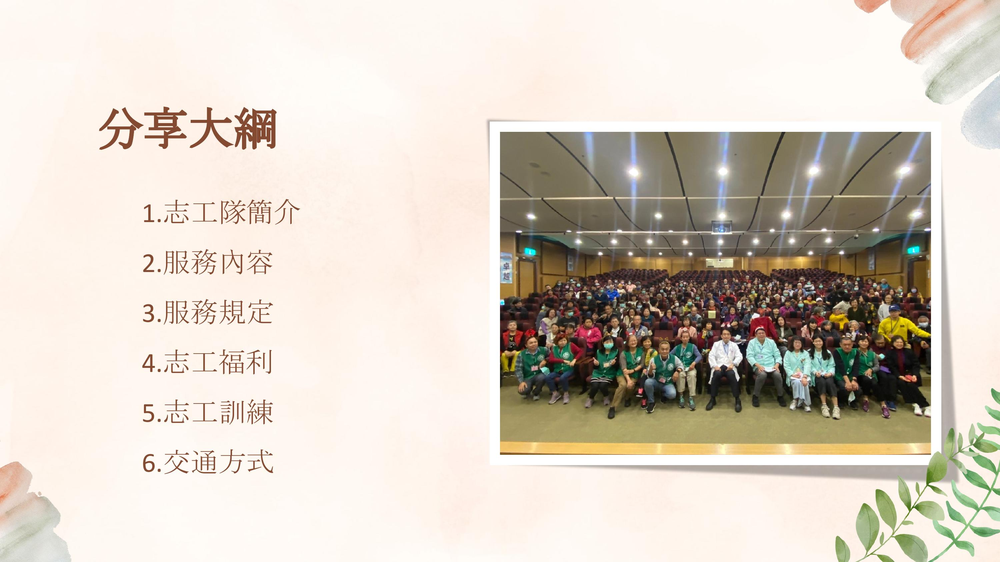

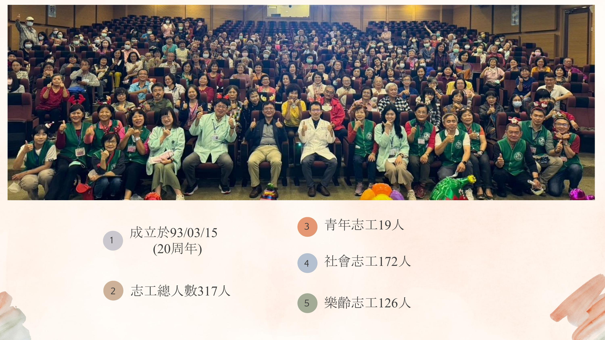

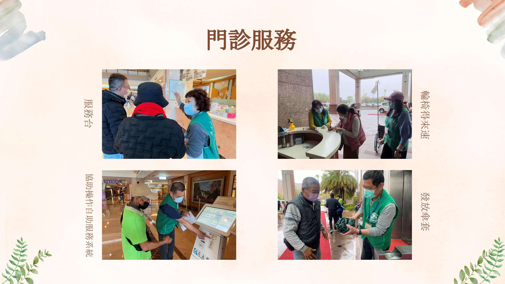

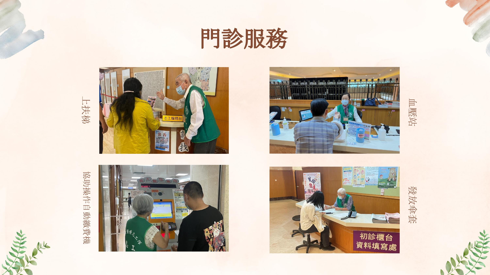

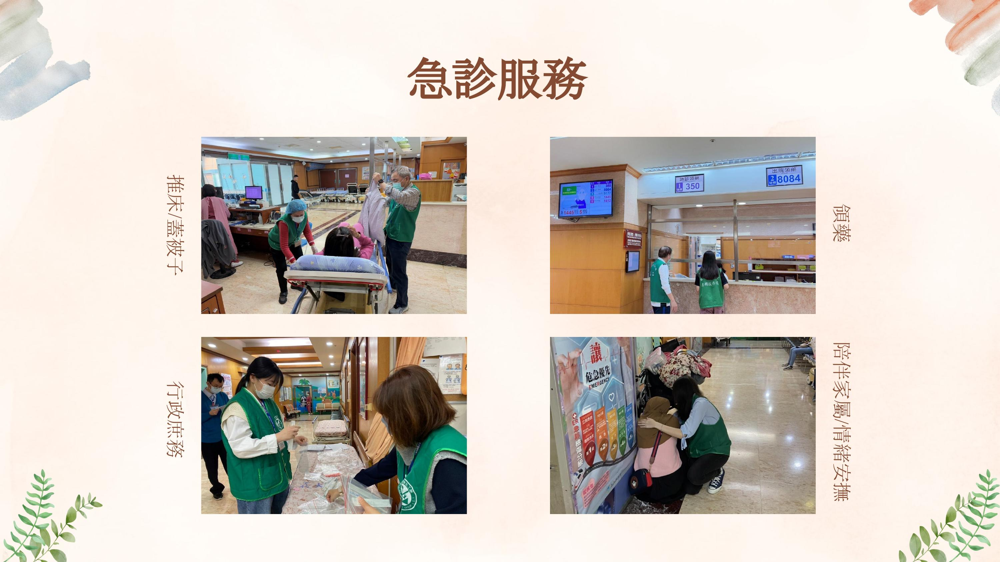

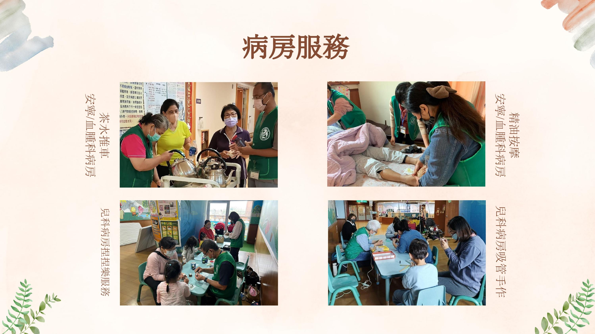

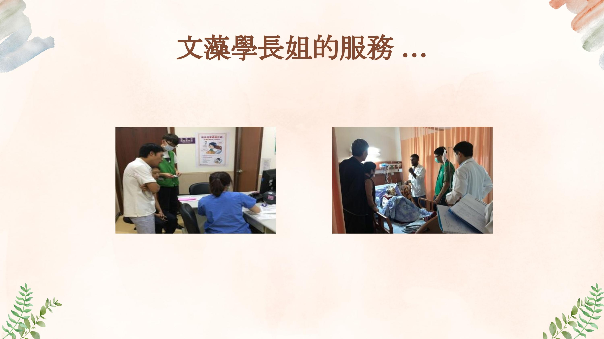

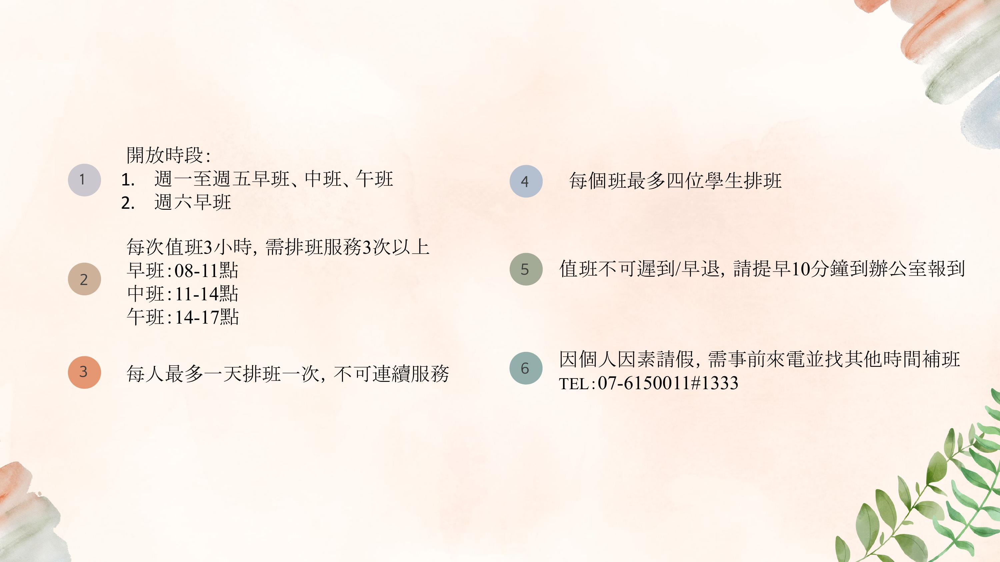

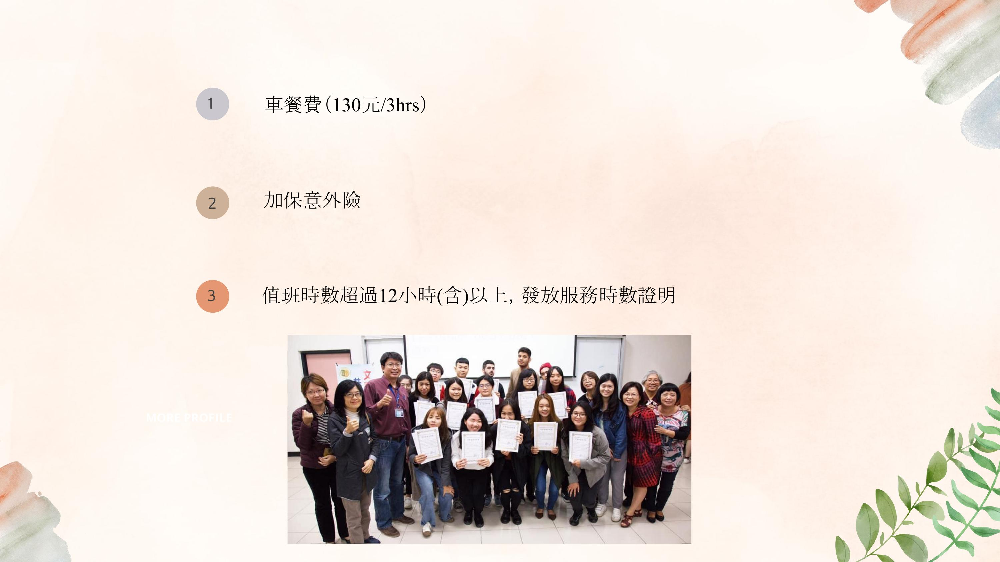

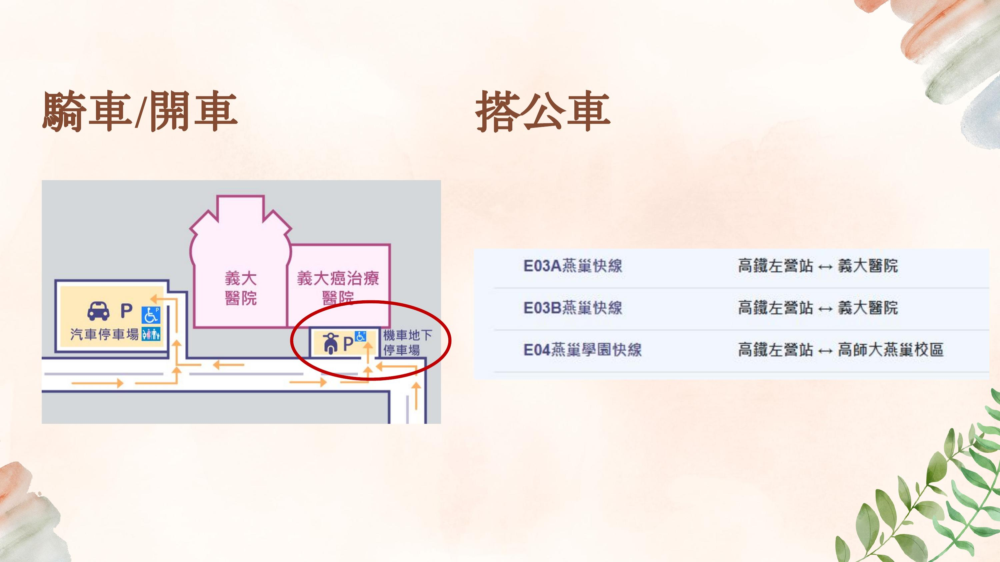

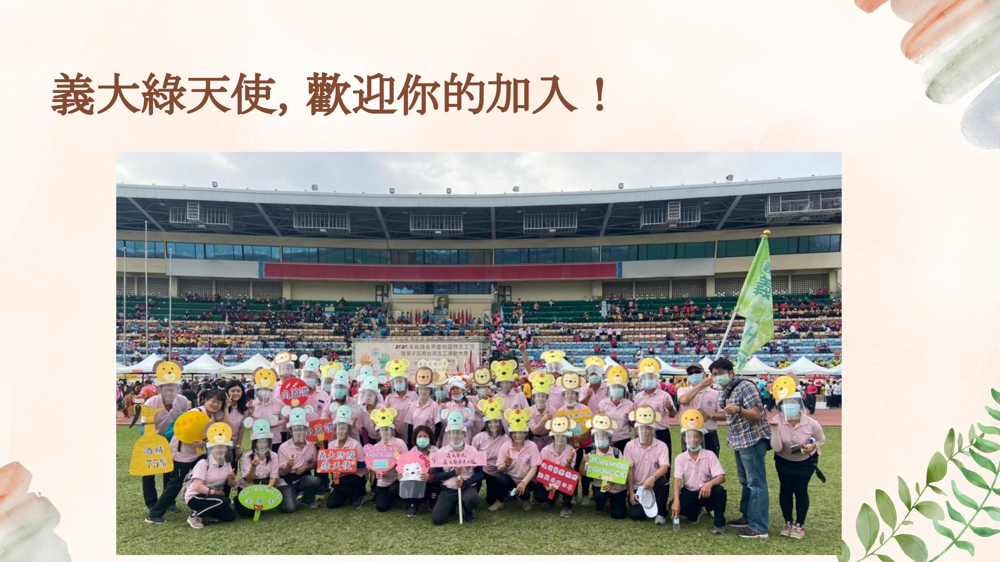

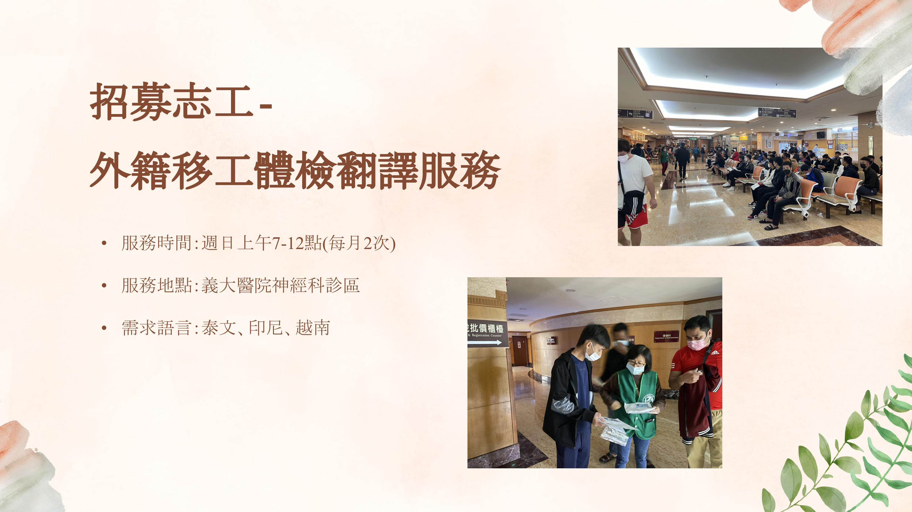

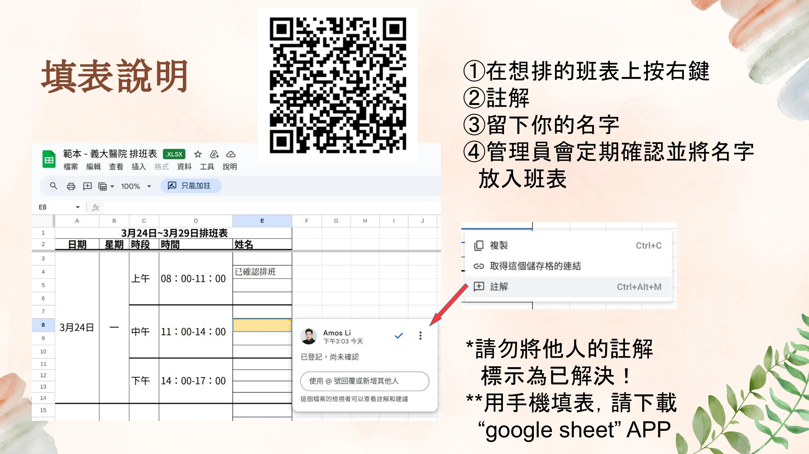

---

[:material-presentation: 簡報原始檔](https://docs.google.com/presentation/d/18C1Un3BH-xSZU1AZHFMlAt95OvD-s4GH/edit?usp=sharing&ouid=115903601626186545097&rtpof=true&sd=true){ .md-button .md-button--primary }
[:material-table: 班表試填](https://docs.google.com/spreadsheets/d/1vGzfZxYLGL2XSGGkreOVMQPZiKUO2EC8Zt3GmE2-CQ0/){ .md-button }

---

## （預計）重要時間點

| 日期 | 事項 |
|------|------|
| 3/16 ~ 3/20 | 排班登記 |
| 3/28 | 新進志工訓練 |
| 3/30 ~ 5/30 | 醫院值班 |
