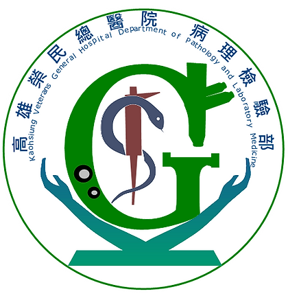
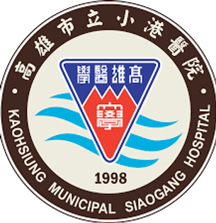
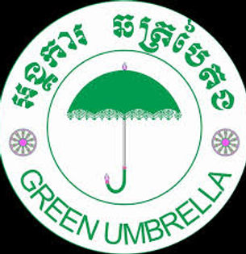
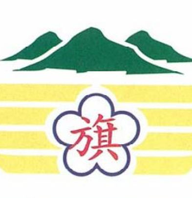
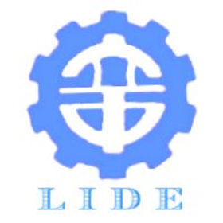
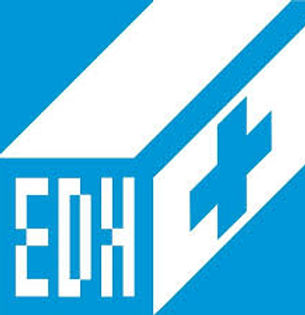
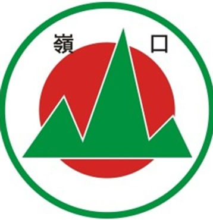
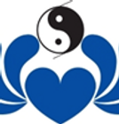

# 合作夥伴 Partners

我們與多個醫療機構、教育單位及國際組織建立長期合作關係，共同推動社會實踐計畫。

---

## 醫療夥伴

{ .partner-logo }

### 高雄榮民總醫院

與文藻僅隔幾條路有「鄰居」之稱的高雄榮民總醫院，於 **2016 年 10 月 01 日**與文藻外語大學結緣，並開啟許多別具意義的志工服務與執行「溫暖白色巨塔的小螺絲釘」USR 社會實踐計畫。

[:octicons-link-external-16: 醫院官網](https://www.vghks.gov.tw/){ target="_blank" }

{ .partner-logo }

### 高雄市立小港醫院

文藻外語大學與「不凡的港醫」小港醫院相遇始於 **2019 年 03 月 26 日**，並攜手建立志工服務與執行「溫暖白色巨塔的小螺絲釘」USR 社會實踐計畫。

[:octicons-link-external-16: 醫院官網](https://www.kmhk.org.tw/){ target="_blank" }

{ .partner-logo }

### 義大醫院

機緣下的巧合遇上五星級的義大醫院，於 **2019 年 09 月 01 日**文藻外語大學開啟了志工服務的另一段故事，並一同開創有溫馨及付出的志工服務與執行「溫暖白色巨塔的小螺絲釘」USR 社會實踐計畫。

[:octicons-link-external-16: 醫院官網](https://www.edah.org.tw/){ target="_blank" }

{ .partner-logo }

### 高雄醫學大學

與高雄醫學大學跨校合作，結合醫學專業與外語能力，共同推動國際醫療志工服務。

---

## 教育夥伴

{ .partner-logo }

### 旗山國小

文藻外語大學與旗山國小緣起於 **2019 年 09 月 01 日**，並一起共創具熱情及溫暖的英語衛教營隊與執行「溫暖白色巨塔的小螺絲釘」USR 社會實踐計畫。

{ .partner-logo }

### 立德國中

與立德國中合作，推動雙語教學與在地文化教育，讓學生透過服務學習拓展國際視野。

{ .partner-logo }

### 蚵寮國中小

深耕高雄蚵寮地區，與蚵寮國中小合作推動英語教育與永續發展主題課程，結合在地漁村文化。

---

## 國際夥伴

{ .partner-logo }

### Cambodia Green Umbrella KKS

國際非營利組織 Green Umbrella 團隊創建的私立 KKS 小學。文藻外語大學與 Green Umbrella 自 **2019 年 01 月 01 日**合作至今，共同展開國際志工服務，讓更多柬埔寨當地小朋友受益。

{ .partner-logo }

### GlobeMed at University of Michigan

文藻國際志工在執行柬埔寨國際志工服務時，結識了志同道合的夥伴 GlobeMed at University of Michigan，並自 **2020 年 03 月 02 日**一起並肩前行在「服務學習」的道路上。

---

## 成為合作夥伴

如果您的組織有興趣與我們合作，歡迎與我們聯繫：

[:material-email: 聯絡我們](contact.md){ .md-button .md-button--primary }
