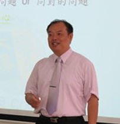
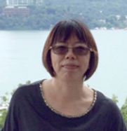
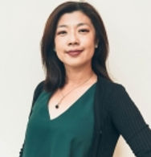
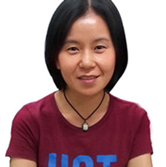
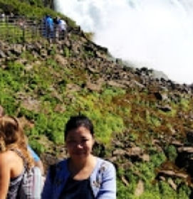
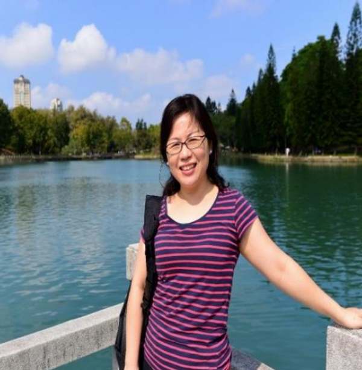
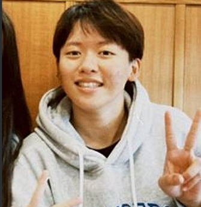

# 計畫團隊 Project Team

## 主持團隊

文藻小螺絲釘 USR 計畫由跨領域教師團隊共同推動，整合校內外資源，致力於大學社會責任實踐。

---

## 計畫總主持人

### 計畫總主持人
**廖俊芳 Melody, Jun-Fang, Liao**

曾有 13 年任職於國際外商銀行以及證券業的實務工作經驗，先後任職於美國運通、統一證券、花旗銀行、匯豐銀行與渣打銀行等跨國知名銀行及企業集團。現今常於業界、公部門擔任卓越服務品質及行銷企劃實做講師，並擔任 LCCI 國際證照及商務企劃能力檢定(TBSA)考照輔導老師。

曾獲得「優良導師獎」(2012)、「產學合作研究傑出獎」(2014;2016;2019)、「私立學校教育事業協會模範教師」(2012;2017)、「教學優良獎」(2018)及「2020 第 13 屆台灣企業永續獎」大學 USR 永續方案銀級獎。

*Throughout her thirteen years of practical professional work experience in top international banks and Securities company, including American Express, Citibank, HSBC, and Standard Chartered Bank, Melody served as former Senior Vice President, Branch Manager, and Marketing Specialist. She received the 13th Taiwan Corporate Sustainability Awards for USR Project in 2020.*

---

## 共同主持人

### 共同主持人
**蔡清華**

**[現職]** 文藻外語大學／外語教學系副教授

**[學歷]** 國立政治大學教育研究所博士；美國紐約州立大學教育領導系博士候選人

**[專長]** 比較教育、師範教育、教育政策、高等教育、教育行政

### 共同主持人
**藍美華 Emma Lan**

**[現職]** 文藻外語大學／外語教學系副教授

**[學歷]** 高雄師範大學英文系（英語教學組）博士；美國亞利桑那州立大學英語系英語教學碩士

**[專長]** 語言教學法、第二外語習得、英語教師培訓、英文讀寫教學、檔案評量

---

## 協同主持人

### 協同主持人
**林虹秀 Eileen Lin**

**[現職]** 文藻外語大學／東南亞碩士學位學程／教授

**[學歷]** 天主教輔仁大學跨文化研究所比較文學博士；紐約哥倫比亞大學古典學系交換學者

**[專長]** 明末天主教文學翻譯、跨文化研究、翻譯研究、口筆譯實務與教學

### 協同主持人
**周春曉**

**[現職]** 文藻外語大學／專任講師

**[學歷]** 舊金山藝術學院電腦藝術系 3D 動畫碩士

**[專長]** 多媒體動畫設計製作、故事腳本及分鏡、3D 模型製作、3D 燈光與材質、角色設定 Rigging、3D 角色動畫

### 協同主持人
**吳紹慈**

**[現職]** 文藻外語大學／法國語文系專任副教授

**[學歷]** 國立政治大學企業管理研究所博士

**[專長]** 國際企業管理、策略管理、社會網絡與組織

### 協同主持人
**趙靜雅**

**[現職]** 文藻外語大學／英國語文系副教授

**[學歷]** 清華大學語言所博士

**[專長]** 語言學、語意學、漢語語法、社會語言學

### 協同主持人
**王志堅 Marcus J. J. Wang**

**[現職]** 文藻外語大學／吳甦樂教育中心／副教授

**[學歷]** 輔仁大學哲學博士 Ph.D. in Philosophy, Fu Jen Catholic University

**[專長]** 自然法理論、吳經熊思想、宗教與法政關係研究、人生哲學、法哲學

---

## 計畫助理

### 計畫助理
**王韻雯 Leona Wang**

文藻外語大學 USR 計畫專任助理

### 計畫助理
**陳佳彣 Teresa Chen**

文藻外語大學／國際事務系

---

## 跨領域教師社群

計畫整合校內 7 個系所中心、11+ 位教師共同開課，詳見[教師社群](faculty.md)頁面。

---

## 加入我們

歡迎有熱情、有行動力的師生加入小螺絲釘團隊！

[:material-arrow-right: 查看招生資訊](join.md){ .md-button .md-button--primary }
